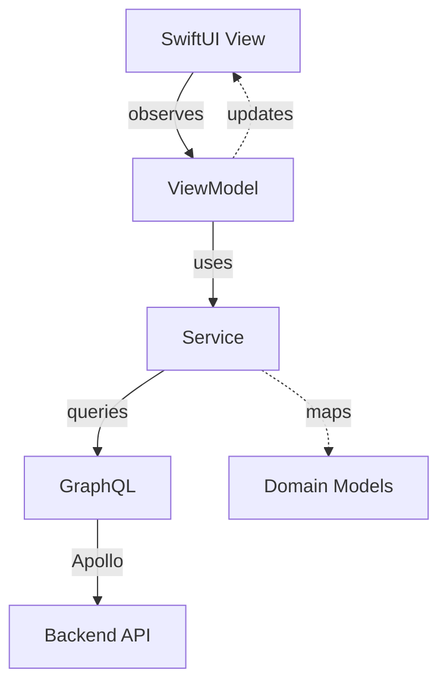

# Pantry iOS Architecture Guide

This guide explains how to work with the Pantry iOS app architecture.

## Overview

The app follows **MVVM + Clean Architecture** with reactive state management using Swift's `@Observable` macro.



## Core Architecture Components

### 1. Views (SwiftUI)

**Purpose**: Display UI and handle user interactions

**Key Rules**:
- Views are declarative and stateless
- Use `@State` only for UI-specific state
- Observe ViewModels for business state
- Navigate using type-safe `NavigationDestination`

**Example**:
```swift
public struct HouseholdListView: View {
    @State private var viewModel: HouseholdListViewModel
    
    public var body: some View {
        List(viewModel.households) { household in
            HouseholdRow(household: household)
        }
        .task {
            await viewModel.loadHouseholds()
        }
    }
}
```

### 2. ViewModels

**Purpose**: Manage view state and coordinate business logic

**Base Class**: All ViewModels extend `BaseReactiveViewModel<State, Dependencies>`

**Key Features**:
- `@Observable @MainActor` for reactive UI updates
- Structured state management
- Built-in loading and error handling
- Dependency injection of services

**Structure**:
```swift
@MainActor
@Observable
public final class YourViewModel: BaseReactiveViewModel<YourViewModel.State, YourViewModel.Dependencies> {
    
    // Define your state
    public struct State {
        var items: [Item] = []
        var selectedId: String?
    }
    
    // Define dependencies
    public struct Dependencies {
        let itemService: ItemServiceProtocol
        let authService: AuthServiceProtocol
    }
    
    // Actions
    public func loadItems() async {
        await performTask(loadingKey: "loadItems") {
            let items = try await dependencies.itemService.getItems()
            updateState { $0.items = items }
        }
    }
}
```

### 3. Services

**Purpose**: Business logic and external communication

**Key Rules**:
- Always implement a protocol for testability
- Handle GraphQL operations and map to domain models
- Implement caching when appropriate
- Use `@MainActor` for UI-bound services

**Example**:
```swift
@MainActor
public final class ItemService: ItemServiceProtocol {
    private let graphQLService: GraphQLServiceProtocol
    
    public func getItems() async throws -> [Item] {
        let query = PantryGraphQL.GetItemsQuery()
        let data = try await graphQLService.query(query)
        return data.items.map { mapToDomain($0) }
    }
}
```

### 4. GraphQL Layer

**Purpose**: Type-safe API communication

**Components**:
- **Operations**: `.graphql` files defining queries/mutations
- **Generated Types**: Swift types generated by Apollo
- **GraphQLService**: Low-level Apollo wrapper
- **ApolloClientService**: Apollo configuration

### 5. Dependency Injection

**Purpose**: Manage service lifecycle and dependencies

**Key Components**:
- **DependencyContainer**: Central service registry
- **ServiceFactory**: Creates services with dependencies
- **ViewModelFactory**: Creates ViewModels with injected services
- **Environment injection**: SwiftUI environment for view access

## Data Flow

### 1. User Action → View → ViewModel

```swift
// In View
Button("Save") {
    Task {
        await viewModel.saveItem()
    }
}
```

### 2. ViewModel → Service → GraphQL

```swift
// In ViewModel
public func saveItem() async {
    await performTask(loadingKey: "save") {
        try await dependencies.itemService.createItem(item)
    }
}
```

### 3. Service → GraphQL → Backend

```swift
// In Service
public func createItem(_ item: Item) async throws -> Item {
    let mutation = PantryGraphQL.CreateItemMutation(input: ...)
    let data = try await graphQLService.mutate(mutation)
    return mapToDomain(data.createItem)
}
```

### 4. Response → Domain Model → ViewModel → View

The response flows back through the same layers, with services mapping GraphQL types to domain models.

## State Management

### App State

**Global state** managed by `AppState`:
- Authentication status
- Current household
- App lifecycle phase
- Error states

### Feature State

**Local state** managed by ViewModels:
- Screen-specific data
- Loading states
- Form inputs
- Selection state

### State Updates

```swift
// In ViewModel
updateState { state in
    state.items = newItems
    state.isLoading = false
}
```

## Error Handling

### Error Types

```swift
// Service errors
public enum ServiceError: LocalizedError {
    case notAuthenticated
    case networkError(Error)
    case invalidData(String)
}

// ViewModel errors
public enum ViewModelError: LocalizedError {
    case validationFailed([ValidationError])
    case operationFailed(String)
    case custom(String)
}
```

### Error Flow

1. Service throws error
2. ViewModel catches in `performTask`
3. Error stored in `lastError`
4. View displays alert

```swift
// Automatic error handling
.alert("Error", isPresented: $viewModel.showingError) {
    Button("OK") { viewModel.dismissError() }
} message: {
    Text(viewModel.errorMessage ?? "An error occurred")
}
```

## Navigation

### Type-Safe Navigation

```swift
public enum NavigationDestination: Hashable {
    case householdDetail(id: String)
    case settings
    case profile(userId: String)
}
```

### Navigation Implementation

```swift
NavigationStack {
    // Content
}
.navigationDestination(for: NavigationDestination.self) { destination in
    switch destination {
    case .householdDetail(let id):
        HouseholdDetailView(householdId: id)
    case .settings:
        SettingsView()
    case .profile(let userId):
        ProfileView(userId: userId)
    }
}
```

## Testing Architecture

### Unit Testing Strategy

1. **Mock Services**: Test ViewModels with mock service implementations
2. **Protocol-Based**: All services implement protocols for easy mocking
3. **Isolated Tests**: Each layer tested independently

### Test Structure

```swift
// Mock service
class MockItemService: ItemServiceProtocol {
    var items: [Item] = []
    func getItems() async throws -> [Item] { items }
}

// ViewModel test
func testLoadItems() async {
    let mockService = MockItemService()
    mockService.items = [Item.mock]
    
    let viewModel = ItemViewModel(
        dependencies: .init(itemService: mockService),
        initialState: .init()
    )
    
    await viewModel.loadItems()
    XCTAssertEqual(viewModel.state.items.count, 1)
}
```

## Performance Considerations

### Caching Strategy

Services implement smart caching:
```swift
private var cache: [Item]?
private var lastCacheUpdate: Date?
private let cacheTimeout: TimeInterval = 300 // 5 minutes

func getItems() async throws -> [Item] {
    if let cache = cache, 
       let lastUpdate = lastCacheUpdate,
       Date().timeIntervalSince(lastUpdate) < cacheTimeout {
        return cache
    }
    // Fetch from API...
}
```

### Loading States

Track individual operations:
```swift
loadingStates.isLoading(for: "saveItem") // Specific operation
showLoadingIndicator // Any operation loading
```

## Security

### Authentication

- Tokens stored in Keychain via `AuthTokenManager`
- Apollo interceptor adds auth headers automatically
- Services check authentication before operations

### Data Protection

- Sensitive data never logged
- User data cleared on logout
- Secure storage for preferences

## Best Practices

### DO:
- ✅ Use protocols for all services
- ✅ Map GraphQL types at service boundaries
- ✅ Handle all errors explicitly
- ✅ Use dependency injection
- ✅ Keep ViewModels focused (single responsibility)
- ✅ Cache data appropriately
- ✅ Use type-safe navigation

### DON'T:
- ❌ Call GraphQL directly from ViewModels
- ❌ Store business logic in Views
- ❌ Use singletons (except AppState)
- ❌ Ignore error handling
- ❌ Mix concerns between layers
- ❌ Store sensitive data in UserDefaults

## Common Patterns

### Loading Pattern
```swift
await performTask(loadingKey: "operation") {
    // Async operation
    // Loading state handled automatically
}
```

### Error Pattern
```swift
do {
    try await riskyOperation()
} catch {
    throw ViewModelError.custom("Operation failed: \(error)")
}
```

### State Update Pattern
```swift
updateState { state in
    state.property = newValue
}
```

## Adding New Features

See [Development Guide](DEVELOPMENT_GUIDE.md) for step-by-step instructions on adding new features following this architecture.