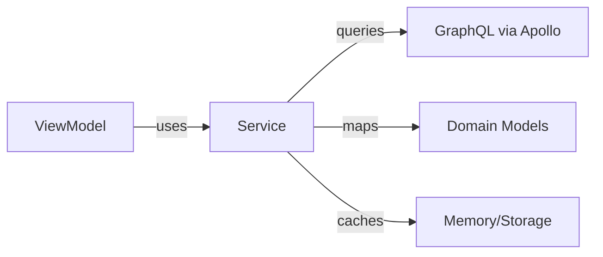

# Service Layer Guide

This guide explains how to work with services in the Pantry iOS app.

## Overview

Services handle business logic and external communication. They sit between ViewModels and GraphQL, providing a clean abstraction for data operations.

**Important**: This app does NOT use the Repository pattern. Services interact directly with GraphQL through the `GraphQLService`, which provides a cleaner and more maintainable architecture.



## Service Architecture

### Key Principles

1. **Protocol-First**: Every service has a protocol for testability
2. **Dependency Injection**: Services receive dependencies via constructor
3. **Domain Mapping**: Services map external types to domain models
4. **Error Handling**: Consistent error types across services
5. **Caching**: Smart caching for performance

### Service Structure

```swift
// Protocol definition
@MainActor
public protocol YourServiceProtocol: Sendable {
    func getData() async throws -> [Item]
    func createItem(_ item: Item) async throws -> Item
}

// Implementation
@MainActor
public final class YourService: YourServiceProtocol {
    private let graphQLService: GraphQLServiceProtocol
    private let authService: AuthServiceProtocol
    
    // Optional caching
    private var cache: [Item]?
    private var lastCacheUpdate: Date?
    
    public init(
        graphQLService: GraphQLServiceProtocol,
        authService: AuthServiceProtocol
    ) {
        self.graphQLService = graphQLService
        self.authService = authService
    }
}
```

## Core Services

### GraphQLService

**Purpose**: Low-level Apollo Client wrapper

**Key Methods**:
```swift
func query<Query>(_ query: Query) async throws -> Query.Data
func mutate<Mutation>(_ mutation: Mutation) async throws -> Mutation.Data
func clearCache() async throws
```

**Usage**:
```swift
let query = PantryGraphQL.GetItemsQuery()
let data = try await graphQLService.query(query)
```

### HouseholdService

**Purpose**: Manage households and members

**Key Features**:
- CRUD operations for households
- Member management (add, remove, change roles)
- Smart caching (5-minute timeout)
- Reactive streams for real-time updates

**Example**:
```swift
// Get current household
let household = try await householdService.getCurrentHousehold()

// Create household
let newHousehold = try await householdService.createHousehold(
    name: "My Family",
    description: "Family household"
)

// Add member
let member = try await householdService.addMember(
    to: householdId,
    userId: userId,
    role: .admin
)
```

### UserService

**Purpose**: User profile management

**Note**: Currently mocked, returns "Test User" as per requirements

**Example**:
```swift
let currentUser = try await userService.getCurrentUser()
let users = try await userService.searchUsers(query: "john")
```

### UserPreferencesService

**Purpose**: Local settings and preferences

**Features**:
- Notification settings
- Theme preferences
- Last selected household
- Import/export preferences

**Example**:
```swift
// Get/set theme
let theme = await userPreferencesService.getThemePreference()
await userPreferencesService.setThemePreference(.dark)

// Remember household selection
await userPreferencesService.setLastSelectedHouseholdId(householdId)
```

### AuthService

**Purpose**: Authentication and session management

**Status**: Infrastructure ready, Better-Auth integration pending

**Features**:
- Token management via Keychain
- Session persistence
- Sign in/out operations

### PermissionService

**Purpose**: CASL-based permission management with reactive UI updates

**Features**:
- Extracts permissions from GraphQL User data
- Builds CASL Ability instances from permission rules
- Watches Apollo cache for permission updates
- Reactive UI updates through `@Observable` chain

**Implementation Pattern**: See [PERMISSION_PATTERN.md](PERMISSION_PATTERN.md) for the reactive permission pattern used in ViewModels

## Creating a New Service

### 1. Define Protocol

In `ServiceProtocols.swift`:

```swift
@MainActor
public protocol RecipeServiceProtocol: Sendable {
    func getRecipes(householdId: String) async throws -> [Recipe]
    func createRecipe(_ recipe: Recipe) async throws -> Recipe
    func updateRecipe(_ recipe: Recipe) async throws -> Recipe
    func deleteRecipe(id: String) async throws
}
```

### 2. Implement Service

```swift
@MainActor
public final class RecipeService: RecipeServiceProtocol {
    private static let logger = Logger(category: "RecipeService")
    
    private let graphQLService: GraphQLServiceProtocol
    private let authService: AuthServiceProtocol
    
    // Cache implementation
    private var recipesCache: [String: [Recipe]] = [:] // householdId -> recipes
    private var lastCacheUpdate: Date?
    private let cacheTimeout: TimeInterval = 300 // 5 minutes
    
    public init(
        graphQLService: GraphQLServiceProtocol,
        authService: AuthServiceProtocol
    ) {
        self.graphQLService = graphQLService
        self.authService = authService
    }
    
    public func getRecipes(householdId: String) async throws -> [Recipe] {
        // Check cache first
        if let cached = recipesCache[householdId],
           let lastUpdate = lastCacheUpdate,
           Date().timeIntervalSince(lastUpdate) < cacheTimeout {
            Self.logger.debug("📦 Returning cached recipes")
            return cached
        }
        
        // Fetch from API
        guard authService.isAuthenticated else {
            throw ServiceError.notAuthenticated
        }
        
        let query = PantryGraphQL.GetRecipesQuery(householdId: householdId)
        let data = try await graphQLService.query(query)
        
        let recipes = data.recipes.map { mapToDomainModel($0) }
        
        // Update cache
        recipesCache[householdId] = recipes
        lastCacheUpdate = Date()
        
        Self.logger.info("✅ Fetched \(recipes.count) recipes")
        return recipes
    }
}
```

### 3. Add to ServiceFactory

In `ServiceFactory.swift`:

```swift
public static func createRecipeService(
    graphQLService: GraphQLServiceProtocol,
    authService: AuthServiceProtocol
) throws -> RecipeServiceProtocol {
    return RecipeService(
        graphQLService: graphQLService,
        authService: authService
    )
}
```

### 4. Add to DependencyContainer

In `DependencyContainer.swift`:

```swift
// Add property
private var _recipeService: RecipeService?

// Add to initialization
_recipeService = try ServiceFactory.createRecipeService(
    graphQLService: graphQLService,
    authService: authService
)

// Add getter
public func getRecipeService() throws -> RecipeServiceProtocol {
    guard let service = _recipeService else {
        throw DependencyContainerError.serviceNotInitialized(serviceName: "RecipeService")
    }
    return service
}
```

## Service Patterns

### Caching Pattern

```swift
private var cache: [String: Data]?
private var cacheTimestamps: [String: Date] = [:]
private let cacheTimeout: TimeInterval = 300 // 5 minutes

func getData(id: String) async throws -> Data {
    // Check cache
    if let cached = cache?[id],
       let timestamp = cacheTimestamps[id],
       Date().timeIntervalSince(timestamp) < cacheTimeout {
        return cached
    }
    
    // Fetch fresh data
    let data = try await fetchFromAPI(id: id)
    
    // Update cache
    if cache == nil { cache = [:] }
    cache?[id] = data
    cacheTimestamps[id] = Date()
    
    return data
}
```

### Error Handling Pattern

```swift
public func performOperation() async throws -> Result {
    do {
        guard authService.isAuthenticated else {
            throw ServiceError.notAuthenticated
        }
        
        let result = try await graphQLService.query(query)
        return mapToDomain(result)
        
    } catch {
        Self.logger.error("❌ Operation failed: \(error)")
        throw handleServiceError(error, operation: "performOperation")
    }
}

private func handleServiceError(_ error: Error, operation: String) -> Error {
    if let serviceError = error as? ServiceError {
        return serviceError
    }
    return ServiceError.operationFailed("\(operation) failed: \(error.localizedDescription)")
}
```

### Logging Pattern

```swift
private static let logger = Logger(category: "ServiceName")

public func operation() async throws {
    Self.logger.info("🚀 Starting operation")
    
    do {
        let result = try await performWork()
        Self.logger.info("✅ Operation succeeded")
        return result
    } catch {
        Self.logger.error("❌ Operation failed: \(error)")
        throw error
    }
}
```

### Reactive Watch Pattern (Apollo Cache Observation)

```swift
// Services return WatchedResult for reactive updates
public func watchUser(id: String) -> WatchedResult<User> {
    // Returns immediately with WatchedResult
    // Apollo watcher observes cache changes
    // Updates trigger automatically when cache changes
}

// ViewModels consume watched results
class ProfileViewModel {
    let currentUser: WatchedResult<User>
    
    init(userService: UserServiceProtocol) {
        // Watch returns immediately
        // Value populated from cache if available
        // Updates automatically on mutations
        self.currentUser = userService.watchCurrentUser()
    }
}
```

## Testing Services

### Mock Implementation

```swift
class MockRecipeService: RecipeServiceProtocol {
    var recipes: [Recipe] = []
    var error: Error?
    var createRecipeCallCount = 0
    
    func getRecipes(householdId: String) async throws -> [Recipe] {
        if let error = error { throw error }
        return recipes
    }
    
    func createRecipe(_ recipe: Recipe) async throws -> Recipe {
        createRecipeCallCount += 1
        if let error = error { throw error }
        recipes.append(recipe)
        return recipe
    }
}
```

### Unit Test Example

```swift
func testGetRecipes() async throws {
    // Arrange
    let mockGraphQL = MockGraphQLService()
    let mockAuth = MockAuthService()
    mockAuth.isAuthenticated = true
    
    let service = RecipeService(
        graphQLService: mockGraphQL,
        authService: mockAuth
    )
    
    mockGraphQL.queryResult = MockRecipeQueryData(
        recipes: [MockRecipe(id: "1", name: "Test Recipe")]
    )
    
    // Act
    let recipes = try await service.getRecipes(householdId: "123")
    
    // Assert
    XCTAssertEqual(recipes.count, 1)
    XCTAssertEqual(recipes.first?.name, "Test Recipe")
}
```

## Service Health Monitoring

All services implement the `ServiceHealth` protocol:

```swift
extension YourService: ServiceHealth {
    public func performHealthCheck() async -> ServiceHealthStatus {
        let startTime = Date()
        var errors: [String] = []
        
        // Check dependencies
        if !authService.isAuthenticated {
            errors.append("Not authenticated")
        }
        
        // Check connectivity
        let isConnected = await testConnection()
        if !isConnected {
            errors.append("No connection")
        }
        
        return ServiceHealthStatus(
            isHealthy: errors.isEmpty,
            lastChecked: Date(),
            errors: errors,
            responseTime: Date().timeIntervalSince(startTime)
        )
    }
}
```

## Best Practices

### DO:
- ✅ Always define a protocol first
- ✅ Use dependency injection
- ✅ Map external types to domain models
- ✅ Implement smart caching
- ✅ Log important operations
- ✅ Handle all error cases
- ✅ Write unit tests
- ✅ Use `.trimmed()` on string inputs before GraphQL mutations (see [TRIMMING_IMPLEMENTATION_NOTE.md](TRIMMING_IMPLEMENTATION_NOTE.md))

### DON'T:
- ❌ Access GraphQL directly from ViewModels
- ❌ Store UI state in services
- ❌ Use singletons
- ❌ Ignore authentication checks
- ❌ Cache sensitive data
- ❌ Skip error handling
- ❌ Add manual string trimming in ViewModels (services handle this)